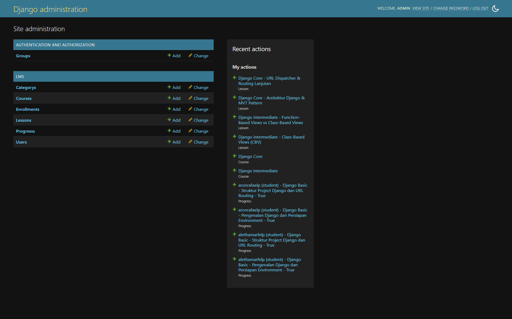
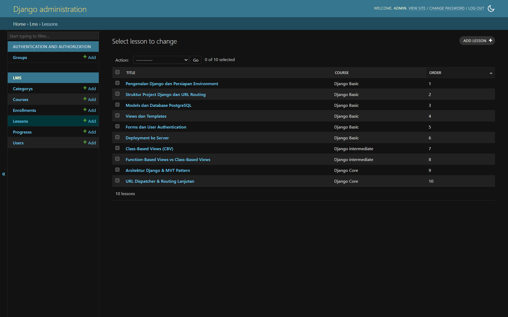
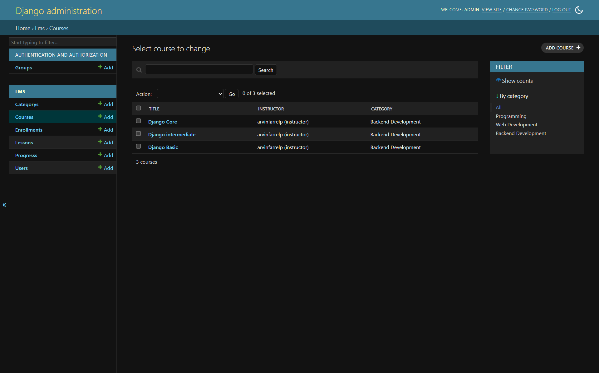
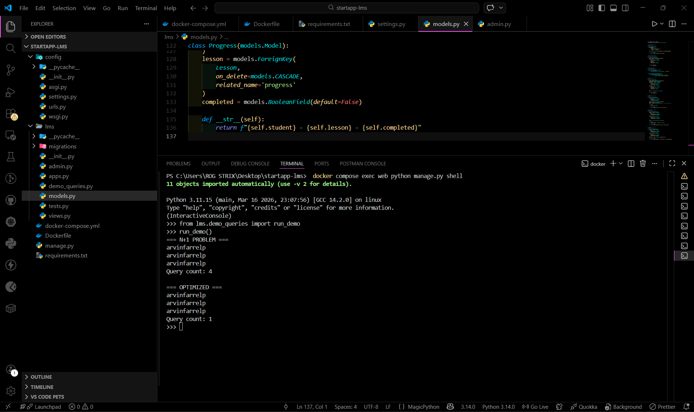

# 🚀 Simple LMS - Django ORM Implementation

## 📌 Deskripsi

Project ini merupakan implementasi **Simple Learning Management System (LMS)** menggunakan Django ORM dengan fokus pada:

- Desain database
- Relasi antar model
- Optimasi query
- Django Admin interface

**Project ini dijalankan menggunakan Docker untuk memastikan environment yang konsisten.**

---

## 🎯 Fitur Utama

### ✅ Data Models

- **User** (Custom dengan role: admin, instructor, student)
- **Category** (self-referencing / hierarchical)
- **Course**
- **Lesson** (dengan ordering)
- **Enrollment** (unique constraint)
- **Progress** (tracking completion)

---

## 📦 Fixtures (Initial Data)

Project ini menyediakan data awal dalam file:

```bash
fixtures.json
```

File ini berisi data:

- User
- Category
- Course
- Lesson
- Enrollment
- Progress

---

### ▶️ Cara Load Fixtures

Jalankan perintah berikut:

```bash
docker compose exec web python manage.py loaddata fixtures.json
```

---

### 💡 Tujuan Fixtures

- Mempermudah testing tanpa input manual
- Menunjukkan implementasi relasi antar model
- Memenuhi requirement assignment (Initial Data Fixtures)

---

## ⚡ Query Optimization

Menggunakan:

- `select_related`
- `prefetch_related`

Custom QuerySet:

```python
Course.objects.for_listing()
Enrollment.objects.for_student_dashboard()
```

---

## 🛠 Django Admin

- List display informatif
- Filter & search
- Inline Lesson di Course
- Data terstruktur dan rapi

---

## 📸 Screenshot

### 🔹 Admin Dashboard



---

### 🔹 Lesson Data (Ordered)



---

### 🔹 Course Data (Relasi)



---

### 🔹 Query Optimization (N+1 vs Optimized)



---

## 🧪 Hasil Query Optimization

| Mode                 | Query Count |
| -------------------- | ----------- |
| Tanpa Optimasi (N+1) | 4           |
| Dengan Optimasi      | 1           |

---

## 🧠 Insight

- N+1 problem menyebabkan banyak query tidak efisien
- `select_related` mengurangi query join
- `prefetch_related` mengoptimalkan relasi many-to-many / reverse
- Performa meningkat signifikan

---

## 📂 Struktur Project (Ringkas)

```
startapp-lms/
│
├── config/
│   ├── __init__.py
│   ├── asgi.py
│   ├── settings.py
│   ├── urls.py
│   └── wsgi.py
│
├── lms/
│   ├── migrations/
│   │   ├── __init__.py
│   │   ├── 0001_initial.py
│   │   ├── 0002_0002_remove_enrollment_enrolled_at_and_more
│   │   └── 0003_0003_alter_course_category_alter_course_instructor_and_more
│   │
│   ├── __init__.py
│   ├── admin.py
│   ├── apps.py
│   ├── demo_queries.py
│   ├── models.py
│   ├── tests.py
│   └── views.py
│
├── img/
│   ├── 1_admin_dashboard.png
│   ├── 2_lessons_data.png
│   ├── 3_courses_data.png
│   └── 4_query_optimization.png
│
├── docker-compose.yml
├── Dockerfile
├── fixtures.json
├── manage.py
├── requirements.txt
└── README.md
```

---

## ⚙️ Cara Menjalankan Project

1. Clone repository:

```bash
git clone https://github.com/ArvinFarrelP/simple-lms-django-orm.git
cd startapp-lms
```

2. Jalankan Docker:

```bash
docker compose up -d --build
```

3. Migrasi database:

```bash
docker compose exec web python manage.py migrate
```

4. Load data awal:

```bash
docker compose exec web python manage.py loaddata fixtures.json
```

5. Akses aplikasi:

```
http://localhost:8000/admin
```

---

## ✅ Status

✔ Data Models lengkap
✔ Relasi antar model berjalan
✔ Query optimization (N+1 solved)
✔ Django Admin fully functional
✔ Fixtures tersedia
✔ Dokumentasi lengkap

---

## 👤 Author

**Arvin Farrel Pramuditya**

---
